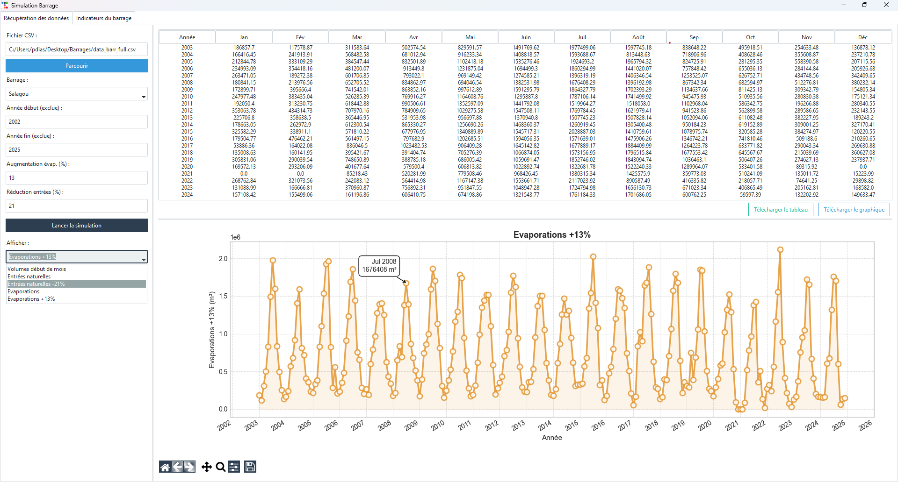
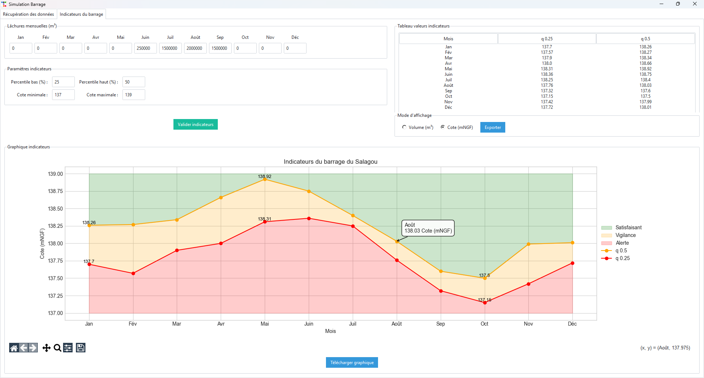

# Statistical Analysis of Herault Dam Levels

## Description
Salagou is a desktop Python application for analyzing and forecasting water levels of a reservoir (Salagou or Olivettes Dam). It allows you to:

- Load water level data from CSV files.
- Visualize levels on interactive charts.
- Define critical thresholds and operational zones.
- Simulate level forecasts based on outflow and evaporation.
- Manually adjust forecasted values.
- Export charts as PNG, PDF, or JPEG.

The application uses **Tkinter** with the **Flatly** theme via **ttkbootstrap**, as well as **matplotlib**, **pandas**, **scipy**, and **mplcursors** for interactive plots.

---

## Main Features

<div style="display: flex; gap: 10px;">
  
  
</div>

### CSV Data Loading
- The CSV must contain a DATE_RELEVE (date), DEBIT_OUT (en m3/s) (water discharge), EVAPORATION (en m3), VOLUME (en m3), COTE (en m).  

### Interactive Visualization
- Matplotlib charts embedded in the Tkinter interface.
- Navigation via toolbar (zoom, pan, save).
- Interactive tooltips showing date, water level, total volume, and usable volume.

### Level Forecasting
- Based on historical data and monthly assumptions of water discharge
- Charts display colored areas corresponding to critical thresholds.

### Manual Adjustments
- Allows adjusting the level for a Evaporation and Entering volume to refine the forecast.

### Chart Export
- Export charts as PNG, PDF, or JPEG.
- Option to remove interactive tooltips before exporting.

---

## Installation

### Requirements
- Python 3.10+
- Install dependencies with:
```bash
pip install -r requirements.txt
```
Required HSV file: HSV_32.txt (for Olivette) or HSV_34.txt (for Salagou) (contains the relations COTE ↔ VOLUME ↔ SURFACE)

### PyInstaller Option
```
pyinstaller --onefile --noconsole --icon=waterdrop_102608.ico --add-data "data;data" splash.py
```


